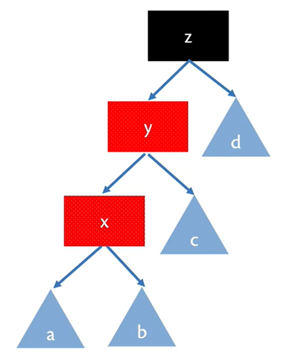
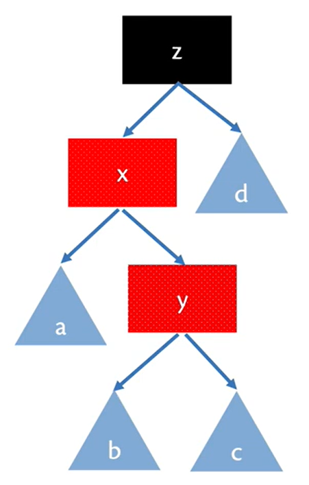
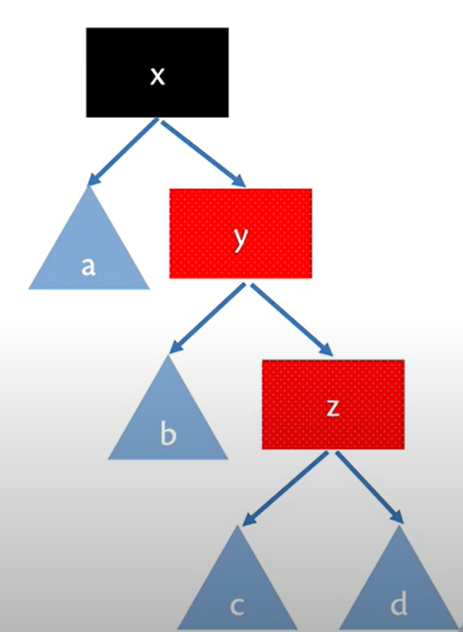
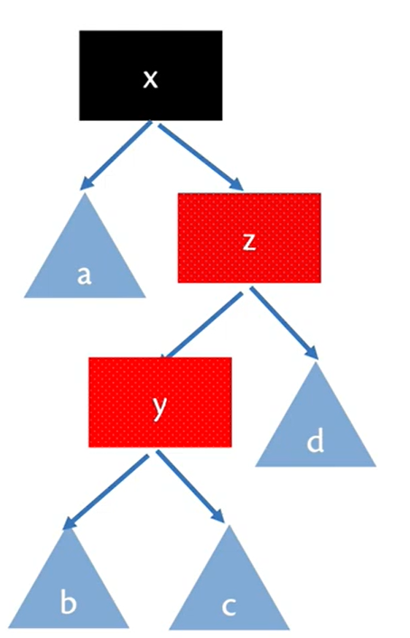

# Table of Contents

- [Red-Black Trees](#section-id-1)
- [Properties](#section-id-8)
  - [Path Length](#section-id-15)
  - [Member (Search in the Red-Black Tree)](#section-id-24)
  - [Insert (Insert in the Red-Black Tree)](#section-id-37)
  - [Complexity](#section-id-98)
- [Implementation: Functional vs. Imperative Programming](#section-id-107)
- [Conclusion](#section-id-112)
  


<div id='section-id-1'/>

# Red-Black Trees
We introduced binary search trees in our previous discussions. Although these trees work very well on random or unordered data, they perform very poorly on ordered data, for which any individual operation might take up to `O(n)` time. The solution to this problem is to keep each tree approximately balanced. Then no individual operation takes more than `O(logn)` time.

A Red-Black Tree is a Binary Search Tree with:
* Each node colored red or black.
* Leaves and Root colored black.

<div id='section-id-8'/>

# Properties
We insist that every red-black tree satisfy the following balance invariants:
* BST
* <span style="color:#3498eb">Local invariant:</span> No red node has a red child.
* <span style="color:#3498eb">Global invariant:</span> Every path from the root to a leaf has the same number of black nodes.
<br>

<div id='section-id-15'/>

## Path Length

* **Lemma**: the length of the longest path in a red-black tree is at most twice length of the shortest path.
    * Eg: B-B-B-B vs. B-<span style="color:red">R</span>-B-<span style="color:red">R</span>-B-<span style="color:red">R</span>-B-<span style="color:red">R</span>
* **Theorem:** the maximum depth of a node in a red-black tree of size n is at most `2[log(n+1)]`.
* So red-black trees are balanced.
* and operations generally run in `O(logn)` time.
<br>

<div id='section-id-24'/>

## Member (Search in the Red-Black Tree)
The algorithm for this would be exactly same as the algorithm used in Binary Search Tree since the only point of difference between Balanced BSTs and BSTs is their way of insertion.

```Ocaml
    let rec mem x = function
    | Leaf -> false
    | Node (_, left, value, right) ->
        if x = value then true
        else if x < value then mem x left
        else mem x right
```
<br>

<div id='section-id-37'/>

## Insert (Insert in the Red-Black Tree)
**Possible Violations while insertion in Red-Black Trees.**

<p align="center">
     
</p>

<br>

<p align="center">
  
  
  
  
</p>

<br>

<p align="center">
    
</p>

**All these violations when rectified rotate to the above figure.**

<br>

Okasaki highlighted the problem of insertion here and gave the suggestion to the address the problem by:
* Always maintaining BST + Global Invariant.
* Maybe violate then restore Local Invariant:
    * Make new node Red
    * Recurse back up tree 
        * On the way, look at the two nodes immediately beneath current node
        * Rotate nodes to balance tree restore Local Invariant.
    * At the top, make the root black
        * Might increase the black height by 1
    

```Ocaml
    (*You cannot find such compact function for balancing in any imperative language*)
    let rotate = function
        | Blk, z, Node (Red, y, Node (Red, x, a, b), c), d
        | Blk, z, Node (Red, x, a, Node (Red, y, b, c)), d
        | Blk, x, a, Node (Red, z, Node (Red, y, b, c), d)
        | Blk, x, a, Node (Red, y, b, Node (Red, z, c, d)) 
        -> Node (Red, y, Node (Blk, x, a, b), Node (Blk, z, c, d))
        | t -> Node t

    let rec insert_aux x = function
        | Leaf -> Node (Red, x, Leaf, Leaf) (*Color the new node red*)
        | Node (c, value, left, right) as n ->
            if x < value then rotate (c, value, insert_aux x left, right)
            else if x > value then rotate (c, value, left, insert_aux x right)
            else n

    let rec insert x s = 
        match insert_aux x s with 
            | Leaf -> failwith "impossible"
            | Node (_, value, left, right) -> Node (Blk, value, left, right) (*Color root black*)
```
<br>

<div id='section-id-98'/>

## Complexity

Will be same for any tree whether staggered, balanced or unbalanced.
| Operation        | Time Complexity           |
| ------------- |:-------------:|
| insert    | O(log n) |
| member      | O(log n)    |
<br>

<div id='section-id-107'/>

# Implementation: Functional vs. Imperative Programming
In OCaml, a red-black tree implementation would likely be based on immutable data structures, which means that the tree would be constructed by creating new nodes rather than modifying existing ones. This can be a more natural fit for the functional programming paradigm, which emphasizes immutability and avoiding side effects.

In contrast, an imperative implementation of a red-black tree would involve modifying existing nodes to balance the tree. This approach is more closely aligned with imperative programming, which allows for mutable data structures and side effects.

<div id='section-id-112'/>

# Conclusion
* We compared the performance of Red-Black Trees and Binary Search Trees on two different datasets: one consisting of 1 million random numbers and the other consisting of a list of natural numbers up to 0.1 million.
* On the dataset of 1 million random numbers, we found that Red-Black Trees took 4 seconds to insert each number, while Binary Search Trees took 2.9 seconds. This suggests that their performance on random datasets is comparable.
* However, on the ordered dataset of natural numbers up to 0.1 million, Red-Black Trees outperformed Binary Search Trees significantly. Red-Black Trees took only 0.19 seconds to insert each number, while Binary Search Trees took 29 seconds. These results align with the theoretical expectations for these data structures.
* We also tested the efficiency of searching for a number in each of the trees and observed similar effects.
* Based on these results, we can conclude that Red-Black Trees are more efficient for datasets with ordered values, while Binary Search Trees may perform better for datasets with random values.

